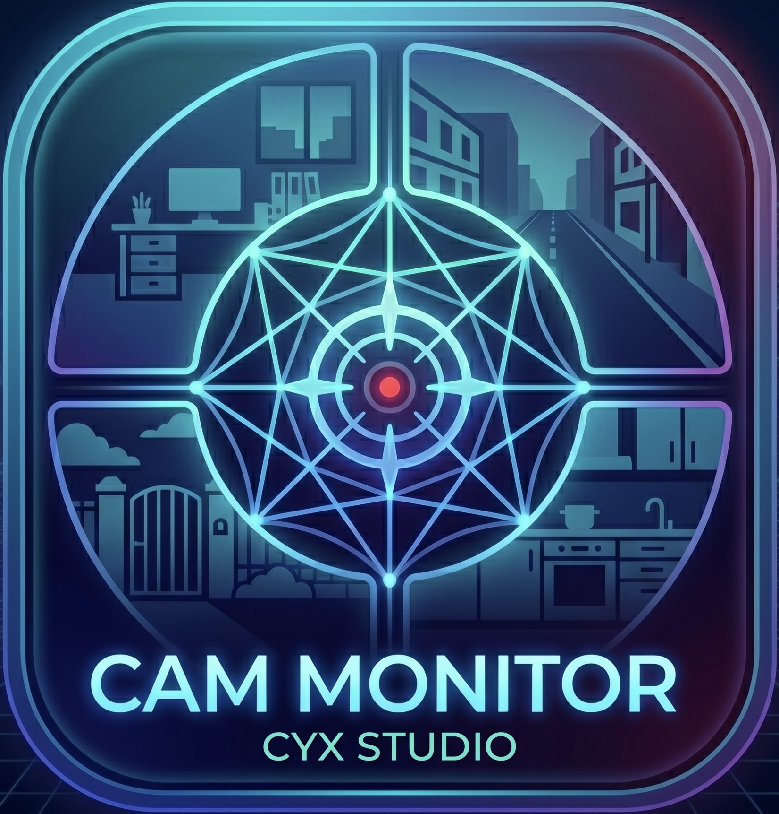

# 🎥 CYX Studio | Multi Cam Monitor

> **High-Performance WebRTC Multi-Camera System with Cinematography UI.**
>
> 專為專業攝影流程設計的跨裝置 WebRTC 多機位監控與檔案管理系統。

🔗 [**Live Demo: 點此進入控制中心 (建議使用 PC 開啟)**] https://cyx-studio-multi-cam-monitor.vercel.app

## ✨ 核心特色 (Features)
* **專業導播級控制台 (Professional Dashboard)**
  電腦端自動適應 1-4 台設備連線，採用 1/5 垂直側邊控制區與 4/5 動態視窗監看區，支援 1x, 2x, 3L, 4 Grid 等多種佈局。
* **靈動島避讓與 App 化體驗 (Island Awareness UI)**
  攝像端針對 iPhone 靈動島 (Dynamic Island) 進行佈局優化，確保橫向拍攝時操作項不被遮擋。支援 PWA (Progressive Web App)，可「加入主畫面」實現 100% 滿版無網址列體驗。
* **高精準 Canvas 渲染引擎 (Advanced Rendering Engine)**
  攝像端採用 HTML5 Canvas 實作最大內接矩形演算法，徹底解決多比例 (4:3 / 16:9) 切換與縮放時的畫面重心偏移問題。
* **WebRTC P2P 低延遲傳輸**
  基於 PeerJS (WebRTC) 技術，實現點對點即時影像串流與數據指令傳輸，具備極低延遲與高安全性。
* **分散式資產管理 (Distributed Asset Management)**
  手機攝像端具備「虛擬資料夾」暫存機制。拍攝與錄影檔案先存放於手機本地緩存，經使用者篩選後再透過 DataChannel 遠端傳輸至電腦端集中儲存。
* **同步攝錄控制與狀態回饋**
  支援電腦端一鍵「全體拍照/錄影」。錄影時攝像端「● LIVE」標記會同步轉為紅色提示，模擬專業攝影機指示燈效果。

## 📸 介面預覽 (Screenshots)

  
   
  
   
  
   
  
  
  

## 🛠️ 技術堆疊 (Tech Stack)
* **Frontend**: Vanilla JavaScript (ES6+), HTML5 Canvas API
* **Communication**: PeerJS (WebRTC P2P Data & Media Channels)
* **Styling**: Modern CSS3 (CSS Grid, Flexbox, Media Queries, Glassmorphism)
* **API**: MediaRecorder API, HTML5 QR Code Scanner, Web Storage API
* **Deployment**: Vercel / PWA Supported

## 🔒 關於原始碼 (About Source Code)
> **Note:** To protect intellectual property and the proprietary rendering logic, the complete source code of this project is maintained in a **Private Repository**. This repository serves as a portfolio to showcase technical architecture and UI/UX implementation.
>
> 為了保護專案智財權與核心渲染引擎邏輯，本專案的完整程式碼存放於私有儲存庫中。此公開儲存庫僅作為作品集展示用途。

*Designed & Developed by [CYX/CYX Studio]*
